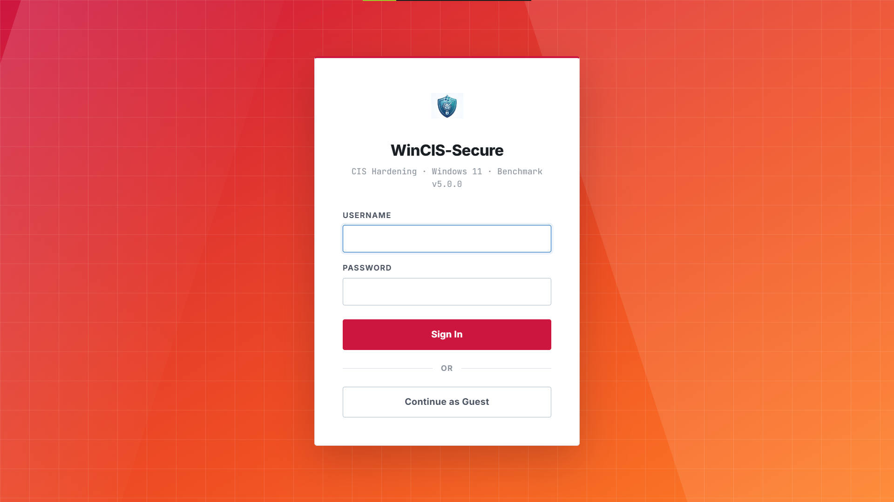
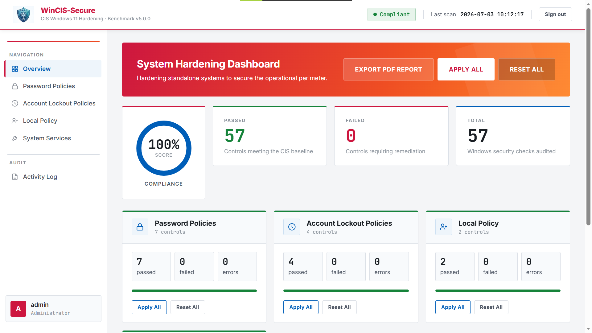
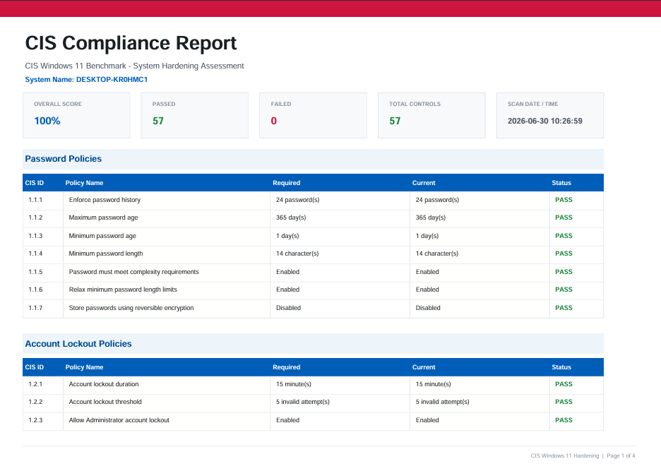

# 🛡️ CIS Windows 11 Hardening Tool

> **Automated endpoint compliance scanner and remediation dashboard — mapped directly to the CIS Microsoft Windows 11 Stand-alone Benchmark v5.0.0**

Built during an OT Security internship at **WinCIS-Secure** as part of Connected Enterprise Security initiatives. Designed for securing air-gapped systems, Operational Technology (OT) networks, and standalone industrial endpoints where manual auditing is slow, error-prone, and unscalable.

---

## 📸 Screenshots

### Login — Role-Based Access Control

*Supports admin and guest roles. Admin can apply and reset policies; guest can audit and export only.*

### System Hardening Dashboard

*Real-time compliance score across 57 Windows security checks. One-click Apply All or Reset All per policy category. PDF export for audit reports.*

---

## ✨ Features

- **57 CIS Controls** across Password Policies, Account Lockout Policies, and System Services
- **Live compliance score** — tracks how many controls pass vs. fail vs. error at a glance
- **One-click remediation** — Apply All or Reset All per category, or individually per control
- **PDF export** — generate a full compliance report for audit trails and stakeholder reporting
- **Role-based access** — Admin (full remediation) and Guest (read-only audit) modes
- **Activity Log** — tracks every policy change with timestamp for accountability
- **Air-gap friendly** — runs entirely locally over Flask, no external dependencies at runtime
- **CIS Benchmark v5.0.0 aligned** — every control maps to a specific CIS recommendation ID

---

## 🏗️ Architecture

```
System-Hardening/
├── app.py                  # Flask application, routing, and access control
├── policies.py             # CIS Benchmark schema, target values, and thresholds
├── policy_executor.py      # Core engine: translates Python rules to Windows OS commands
├── requirements.txt        # Python dependencies
├── data/                   # Isolated storage for scan results and audit logs
│   ├── activity_log.json
│   └── custom_values.json
├── static/                 # Frontend assets
│   ├── style.css           
│   └── dashboard.js        
└── templates/              # HTML templates
    ├── dashboard.html
    ├── logs.html
    └── login.html

```

**Stack:** Python · Flask · HTML/CSS · JavaScript · Windows Registry API (`winreg`) · `subprocess` (secedit/sc)

---

## 🚀 Getting Started

### Prerequisites

- Windows 11 (required — reads Windows Registry and Group Policy)
- Python 3.10+
- Run as **Administrator** (required for registry writes and policy application)

### Installation

```bash
# 1. Clone the repository
git clone https://github.com/Niranjan20061907/System-Hardening.git
cd System-Hardening

# 2. Install dependencies
pip install -r requirements.txt

# 3. Run the application (as Administrator)
python app.py
```

### Access the dashboard

Open your browser and navigate to:
```
http://127.0.0.1:5000
```

Sign in as **admin** to apply and reset policies, or **Continue as Guest** for read-only audit access.

---

## 🔍 What Gets Audited

| Category | Controls | What It Checks |
| --- | --- | --- |
| **Password Policies** | 7 | Length, history, age, complexity, reversible encryption[cite: 1] |
| **Account Lockout Policies** | 4 | Lockout threshold, duration, observation window, administrator lockout[cite: 1] |
| **Local Policy** | 2 | User rights assignment (Allow log on locally, Back up files and directories)[cite: 1] |
| **System Services** | 44 | Service startup state for 44 Windows services per CIS guidance[cite: 1] |
| **Total** | **57** |  |


Each control reports:
- ✅ **PASS** — current setting meets CIS requirement
- ❌ **FAIL** — current setting does not meet CIS requirement (remediation available)
- ⚠️ **ERROR** — setting could not be read (permissions or OS edition issue)

---

## 📊 Compliance Report (PDF Export)

Click **EXPORT PDF REPORT** on the dashboard to download a formatted, paginated audit report. The report contains an executive summary of the overall score followed by a tabular breakdown of:

* **CIS ID & Policy Name**
* **Required Value vs. Current Value**
* **Pass/Fail Status**

Use this for audit documentation, tracking compliance score improvements (e.g., advancing from 30% to 100% compliant), and sharing with engineering stakeholders.

---

## 🏭 OT / ICS Relevance

Traditional IT hardening tools assume internet-connected, domain-joined systems. This tool is designed for the realities of **Operational Technology environments**:

- **Air-gap compatible** — no internet required, no cloud dependencies
- **Standalone endpoint focus** — targets Windows 11 HMI/SCADA workstations, historian nodes, and engineering stations
- **Non-disruptive audit** — read-only guest mode lets you scan without changing anything
- **Remediation control** — Apply and Reset are explicit, per-category actions, not automatic, giving operators full control

---

## 📋 CIS Benchmark Reference

This tool implements controls from:

> **CIS Microsoft Windows 11 Stand-alone Benchmark, Version 5.0.0**
> Center for Internet Security — [https://www.cisecurity.org](https://www.cisecurity.org)

Each control in `policies.py` references the exact CIS recommendation ID (e.g., `1.1.1`, `2.3.1`) for traceability.

---

## 🗺️ Roadmap

- [ ] Audit Policy controls (Event Log, Windows Audit settings)
- [ ] SMBv1 / NetBIOS detection (critical for OT — WannaCry attack surface)
- [ ] Scheduled automatic scans with email/webhook alerts
- [ ] Scan history and compliance trend chart
- [ ] Docker support for deployment on Windows Server

---

## 👤 Author

**Niranjan Krishnarajarajan**
B.Tech Computer Science, NIT Rourkela (2nd Year)

---

## ⚖️ Disclaimer

This tool modifies Windows Registry and Group Policy settings. Always test in a non-production environment before applying to operational systems. The author and Rockwell Automation are not responsible for system instability caused by applying CIS hardening controls to production OT endpoints.

---

*CIS Windows 11 Benchmark v5.0.0 · © 2026 Niranjan Krishnarajarajan*
